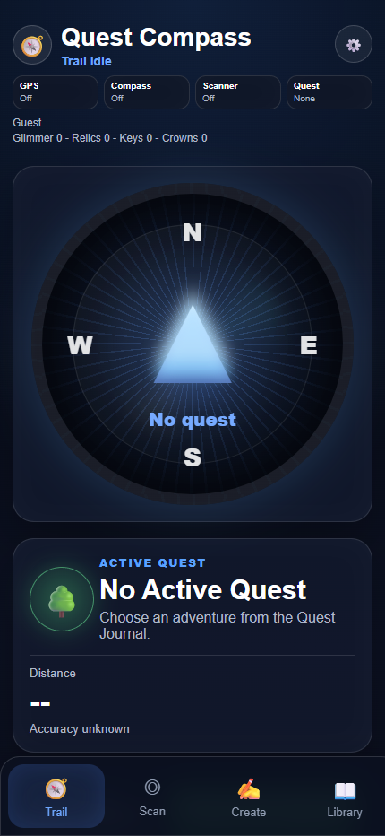

# Quest Compass

> GPS gets you close. The glyph makes the discovery real.

[Open the live prototype](https://ijustcreate.github.io/location-based-quest-guide-app/) · [View the source](https://github.com/ijustcreate/location-based-quest-guide-app)



Quest Compass is a mobile-first, location-based adventure app for turning ordinary places into small playable quests. Explorers save or choose a waypoint, follow its bearing, then scan a physical marker to confirm the final discovery.

The current **v0.8.0 prototype** is static, installable, local-first, and hosted on GitHub Pages. It includes an experimental 15-glyph camera scanner and a limited Supabase adapter for browsing and submitting public locations.

## The play loop

1. Create a waypoint from current GPS or pasted map coordinates.
2. Give it a name, clue, photo, and one or more glyph objectives.
3. Select the quest in the Journal and begin the trail.
4. Follow distance and bearing until you reach the marker.
5. Hold the correct glyph steady in the scanner to lock it and record progress.

The interface exposes system state at every step: GPS on/off, compass on/off, scanner state, selected quest, distance, accuracy, glyph progress, save state, and cloud-sync result.

## What works today

### Trail

- Live GPS tracking, target bearing, distance, accuracy, and proximity language.
- Compass heading where the browser and device expose it.
- Clear idle/active states; GPS is requested only after a location-based action.
- A compact control rail that keeps GPS, compass, scanner, and Journal status visible.

### Scanner

- Red, yellow, blue, green, and black triangles, circles, and squares.
- Canonical IDs such as `red_triangle` and `black_square`.
- Searching → signal found → holding steady → glyph locked state progression.
- Live color, shape, light, stability, confidence, and lock feedback.
- Exact objective matching; a wrong glyph does not complete the waypoint.
- Canvas photo evidence for successful local sightings.

The detector is intentionally lightweight. It is tuned for thick marker outlines on light paper in ordinary indoor lighting, not general computer vision.

### Create and Journal

- Save current GPS or paste coordinates from a map link.
- Add names, hints, photos, facing direction, and required/optional glyph objectives.
- Preserve coordinates while editing unless replacement is explicitly requested.
- Browse local, nearby public, and shared sections from the Quest Journal.
- Begin, edit, delete, export, import, and reset local quest data.
- Hide exact latitude/longitude by default in the interface.

### Mobile/PWA shell

- Safe-area-aware layout and bottom navigation.
- Installable-app manifest and mobile metadata.
- First-entry “found a symbol?” handoff.
- Scroll-safe settings and modals that stay above scanner and compass layers.

## Run locally

There is no package manager or build step. Serve the repository as static files:

```bash
python -m http.server 5177
```

Open [http://127.0.0.1:5177](http://127.0.0.1:5177).

Opening `index.html` directly is enough for layout work, but camera, geolocation, and module behavior are more reliable from a server. For real phone testing, use the HTTPS GitHub Pages deployment or another secure context.

## Architecture

| File | Responsibility |
| --- | --- |
| `index.html` | App shell, tabs, dialogs, PWA metadata, and scanner/compass surfaces |
| `styles.css` | Mobile layout, safe areas, visual states, scanner HUD, and controls |
| `app.js` | Main state machine, rendering, permissions, tabs, forms, Journal, and cloud handoff |
| `camera.js` | Camera startup, color segmentation, shape classification, confidence, and lock flow |
| `navigation.js` | Distance, bearing, compass labels, target arrow, and arrival logic |
| `storage.js` | Local accounts, settings, waypoint schemas, progress, import/export, and migrations |
| `cloud.js` | Supabase public-location reads and public-location submission adapter |
| `supabase/migrations/` | Backend schema, row-level policies, glyph support, and public submission RPC |
| `manifest.json`, `icon.svg` | Installable-app metadata and icon |

The browser remains the primary application runtime. Supabase is an optional public data channel, not the source of truth for a local explorer’s full account and quest history.

## Data, privacy, and permissions

Quest Compass handles precise location and camera data. Treat that as sensitive even when the interface hides the raw numbers.

- Local waypoints, photos, settings, accounts, session state, and progress are stored in the current browser’s `localStorage`.
- Local prototype passwords are stored as part of that browser data and are **not secure authentication**. Do not reuse a real password.
- Camera frames are processed in the browser. Local photo evidence remains browser data unless a future flow explicitly uploads it.
- Private locations are not submitted through the current cloud adapter.
- Marking/submitting a location as public sends its coordinates, name, clue/hint, accuracy, and glyph objectives to the configured Supabase project.
- Public locations can be read by visitors and may be distance-sorted after the visitor chooses to share GPS with the browser.
- Exact coordinates being hidden in the UI does not remove them from saved or public data.
- Clearing browser site data removes local quests unless they were exported first.

The included Supabase schema has broader account, invite, reward, and progress tables, but hosted account authentication and full cross-device progress are not connected to the current static client.

## Deployment

The repository is a static GitHub Pages site. Publishing does not require a build artifact: the checked-in HTML, CSS, JavaScript, manifest, icon, and Supabase client adapter are served directly over HTTPS.

Live site: [ijustcreate.github.io/location-based-quest-guide-app](https://ijustcreate.github.io/location-based-quest-guide-app/)

## Status and known limitations

**Status:** shareable v0.8.0 field prototype; suitable for controlled playtests, not safety-critical navigation.

- Camera classification is heuristic and sensitive to light, blur, marker thickness, distance, rotation, and shadows.
- Compass APIs and calibration behavior vary substantially by browser and phone.
- GPS is not precise enough for room-level indoor navigation and can drift near buildings.
- Local accounts are convenience profiles, not secure identities.
- Cross-device account sync, invite acceptance, cloud progress, and cloud administration are not complete.
- Public-location sync is limited: public reads and submission exist, while private/local state remains device-specific.
- There is no quest-chain editor, built-in QR generator, service-worker offline cache, or automated browser test suite yet.
- A real-world quest creator is responsible for permission, accessibility, physical safety, and avoiding sensitive/private locations.

## Verification

Syntax-check the modules:

```bash
node --check app.js
node --check camera.js
node --check cloud.js
node --check navigation.js
node --check storage.js
```

Then test the live flow on an actual phone over HTTPS:

- decline and grant GPS deliberately;
- calibrate compass behavior;
- create/edit a waypoint without silently replacing coordinates;
- scan several colors and shapes in mixed lighting;
- export and re-import local data;
- confirm private locations stay local and public submission explains the consequence.

The app should remain useful when sensors or cloud services are unavailable. “Not available” is a valid state; pretending otherwise is not.
